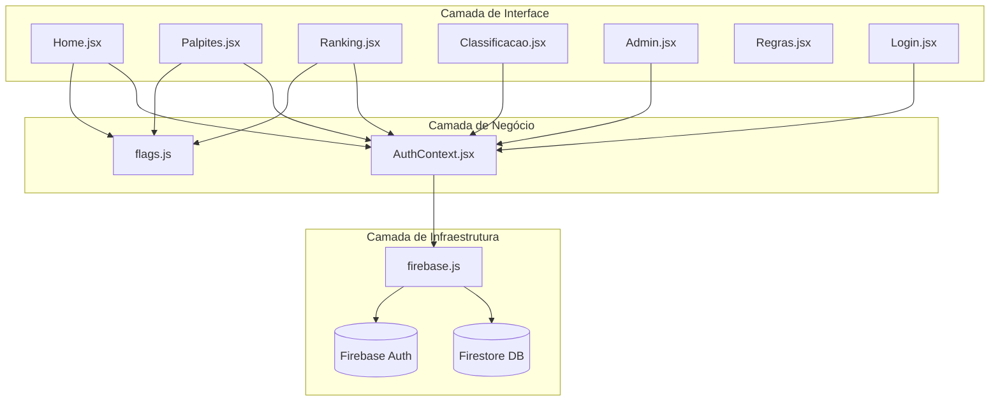

# 🏛️ ARCHITECTURE — Mapa de Módulos do Sistema

Este é o mapa de arquitetura do Bolão da Copa do Mundo 2026. A aplicação é uma SPA (Single Page Application) construída em React + Vite, operando no modelo Serverless integrado ao Firebase (Firestore e Auth).

## Visão Geral da Arquitetura

O sistema adota uma estrutura em 3 camadas de dependência unidirecional:
1.  **Fronteiras / Interface (Pages & UI):** Componentes visuais e páginas do aplicativo.
2.  **Núcleo de Negócio (Contexts & Logic):** Gerenciamento de estado global e regras de negócio.
3.  **Infraestrutura (Lib & DB):** Serviços externos, comunicação com banco de dados e APIs.

---

## Módulos do Sistema

| Módulo | Responsabilidade | Depende de | Contrato / Registro |
| :--- | :--- | :--- | :--- |
| **Auth** | Controle de login, cadastro, logout e sessão do usuário. | Firebase | `eae/memory/modules/context_auth.md` |
| **Home** | Dashboard inicial, premiação, grupo de WhatsApp e palpites em tempo real. | Auth, Flags | `eae/memory/modules/context_home.md` |
| **Palpites** | Inserção, edição e trava de palpites por jogo e rodada (incluindo mata-mata). | Auth, Flags | `eae/memory/modules/context_palpites.md` |
| **Ranking** | Exibição de pontuações de participantes com ordenação de pontos/exatos. | Auth, Flags | `eae/memory/modules/context_ranking.md` |
| **Classificação** | Visualização da tabela de grupos da Copa do Mundo. | Auth | `eae/memory/modules/context_classificacao.md` |
| **Regras** | Exibição do regulamento do bolão e tabela de pontos. | Auth | `eae/memory/modules/context_regras.md` |
| **Admin** | Painel administrativo de controle de usuários, partidas e recálculo de pontos. | Auth, Firebase | `eae/memory/modules/context_admin.md` |
| **Firebase** | Inicialização dos serviços client do Firebase Firestore e Auth. | - | `eae/memory/modules/context_firebase.md` |
| **Flags** | Mapeamento estático de seleções para bandeiras (emojis). | - | `eae/memory/modules/context_flags.md` |

---

## Direção de Dependência

Em conformidade com o princípio §2 da Constituição:
*   A camada de **Interface (Pages)** consome apenas o **Core (Contexts & Utilities)**.
*   A camada de **Core** consome apenas a **Infraestrutura (Firebase)**.
*   Não existem acoplamentos circulares. O banco de dados de produção e o mecanismo de autenticação servem como bases puramente funcionais consumidas pela infraestrutura.
